# SaaS Backend Boilerplate - Systems Architecture

> **Version**: 1.0
> **Database**: MongoDB
> **Framework**: Express.js + TypeScript
> **Auth**: Clerk (with dev mode fallback)

---

## Table of Contents

1. [Overview](#overview)
2. [High-Level Architecture](#high-level-architecture)
3. [Core Components](#core-components)
4. [Request Flow](#request-flow)
5. [Database Architecture](#database-architecture)
6. [Feature Development Pattern](#feature-development-pattern)
7. [Authentication & Authorization](#authentication--authorization)
8. [Error Handling System](#error-handling-system)
9. [Module System](#module-system)
10. [Adding New Features](#adding-new-features)
11. [Best Practices](#best-practices)

---

## Overview

This boilerplate provides a **production-ready, modular backend architecture** designed for rapid SaaS MVP development. It follows clean architecture principles with clear separation of concerns, comprehensive error handling, and type safety throughout.

### Key Characteristics

- **Type-Safe**: Strict TypeScript with zero type errors
- **Modular**: Optional modules load conditionally based on environment
- **Production-Ready**: Security, logging, monitoring, audit trails
- **Developer-Friendly**: Works locally with minimal setup
- **Scalable**: Feature-based structure that grows with your app

---

## High-Level Architecture

### System Overview

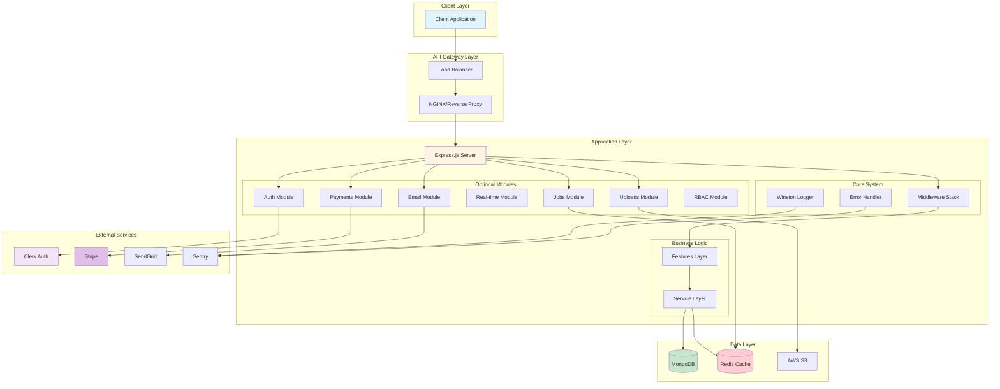

### Application Structure

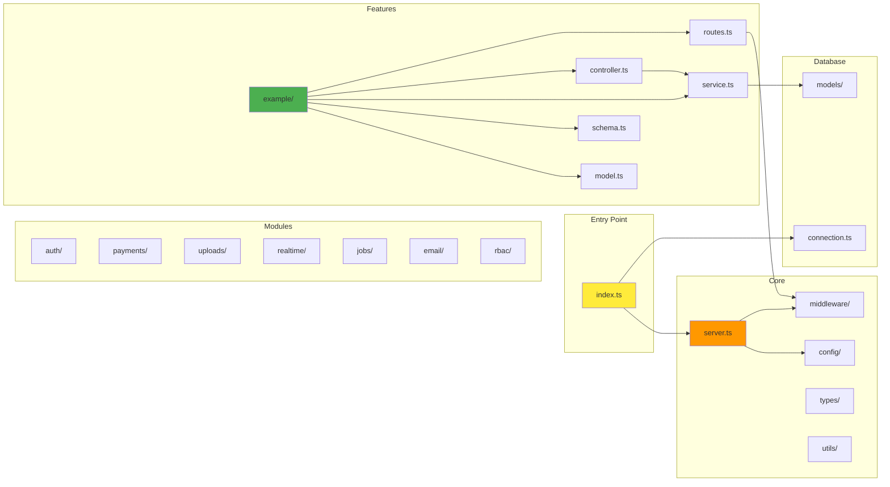

---

## Core Components

### Component Hierarchy

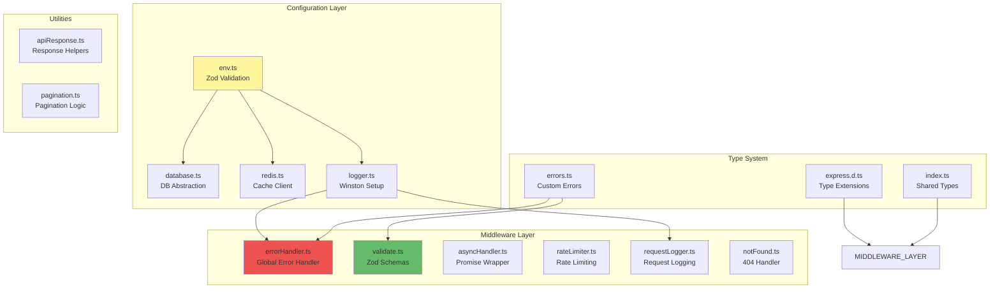

### Middleware Stack Order

```mermaid
graph TD
    START[Incoming Request] --> TRUST_PROXY[Trust Proxy]
    TRUST_PROXY --> HELMET[Helmet<br/>Security Headers]
    HELMET --> CORS[CORS<br/>Origin Check]
    CORS --> BODY_PARSER[Body Parser<br/>JSON/URL-encoded]
    BODY_PARSER --> COMPRESSION[Compression<br/>gzip responses]
    COMPRESSION --> RATE_LIMIT[Rate Limiter<br/>/api routes]
    RATE_LIMIT --> REQUEST_LOG[Request Logger<br/>Winston]
    REQUEST_LOG --> RESPONSE_HELPERS[Response Helpers<br/>res.success()]
    RESPONSE_HELPERS --> ROUTES[Route Matching]

    ROUTES --> ROUTE_AUTH{Auth Required?}
    ROUTE_AUTH -->|Yes| REQUIRE_AUTH[requireAuth]
    ROUTE_AUTH -->|No| ROUTE_VALIDATE
    REQUIRE_AUTH --> ROUTE_VALIDATE{Validation?}

    ROUTE_VALIDATE -->|Yes| VALIDATE_MW[validate Middleware]
    ROUTE_VALIDATE -->|No| ROUTE_ROLE
    VALIDATE_MW --> ROUTE_ROLE{Role Check?}

    ROUTE_ROLE -->|Yes| REQUIRE_ROLE[requireRole/Permission]
    ROUTE_ROLE -->|No| CONTROLLER
    REQUIRE_ROLE --> CONTROLLER[Controller Handler]

    CONTROLLER --> SERVICE[Service Layer]
    SERVICE --> DATABASE[(Database)]
    DATABASE --> RESPONSE[Send Response]

    CONTROLLER -.->|Error| ERROR_HANDLER[Error Handler]
    SERVICE -.->|Error| ERROR_HANDLER
    DATABASE -.->|Error| ERROR_HANDLER
    ERROR_HANDLER --> ERROR_RESPONSE[Error Response]

    ROUTES -.->|No Match| NOT_FOUND_HANDLER[404 Handler]
    NOT_FOUND_HANDLER --> NOT_FOUND_RESPONSE[404 Response]

    style START fill:#4caf50
    style ERROR_HANDLER fill:#f44336
    style CONTROLLER fill:#2196f3
    style SERVICE fill:#ff9800
    style DATABASE fill:#9c27b0
```

---

## Request Flow

### Complete Request Journey

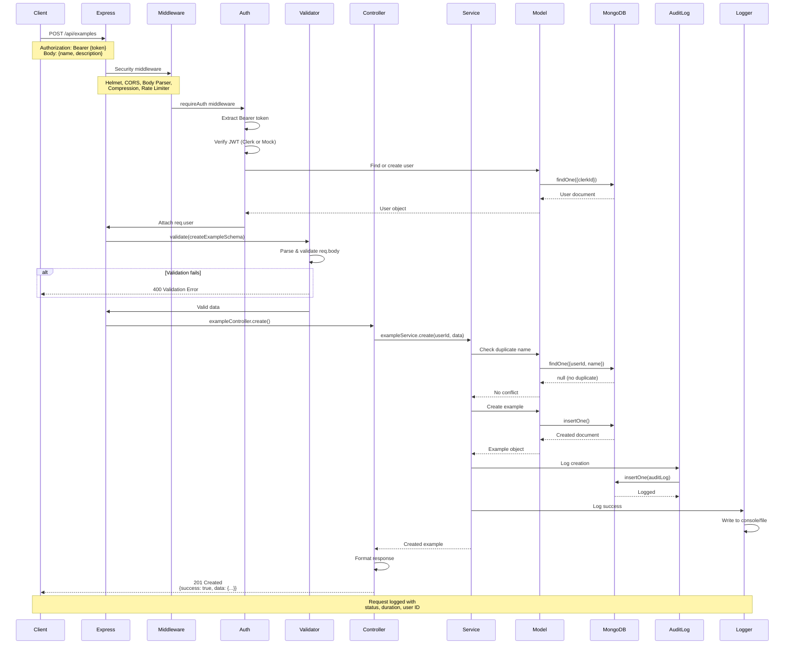

### Error Handling Flow

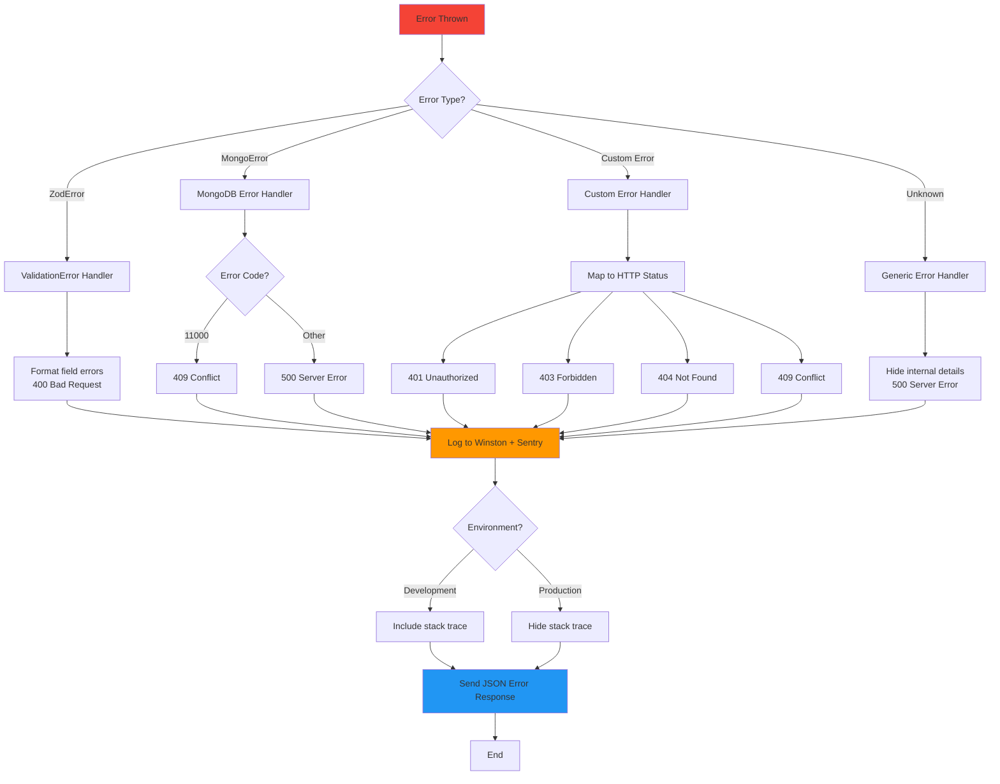

---

## Database Architecture

### MongoDB Schema Design

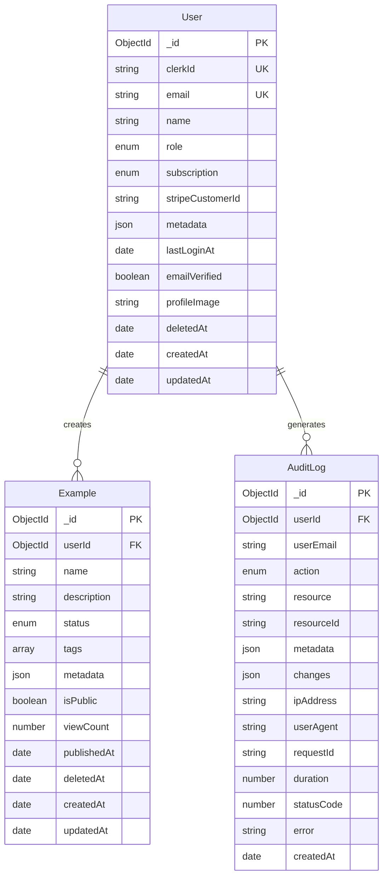

### Index Strategy

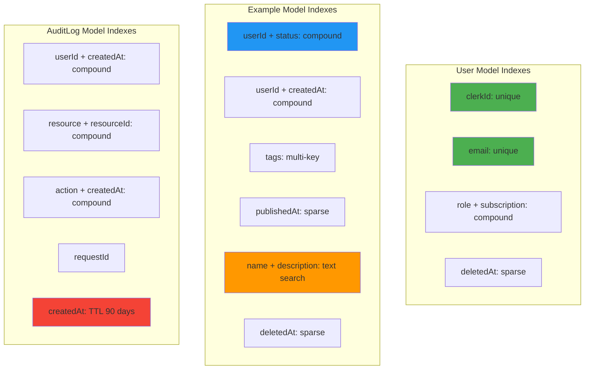

### Database Operations Pattern

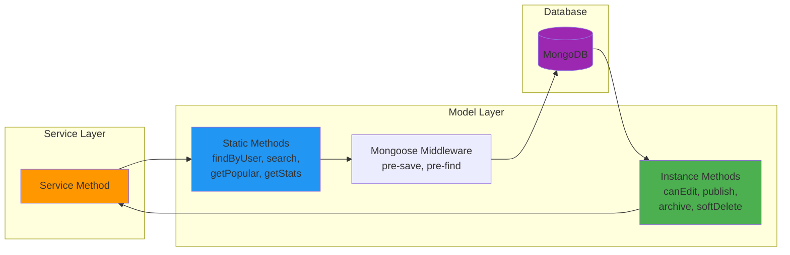

---

## Feature Development Pattern

### Feature Layer Architecture

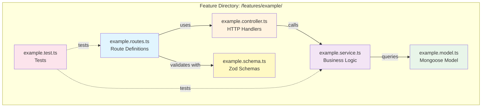

### Feature Component Interaction

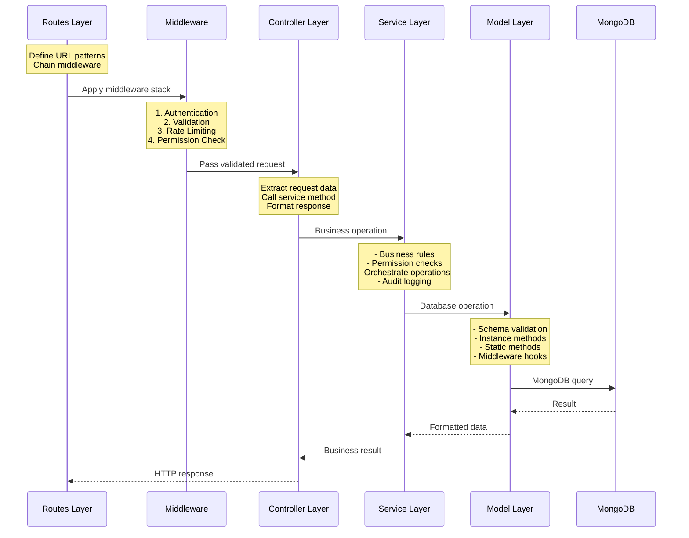

### Layer Responsibilities

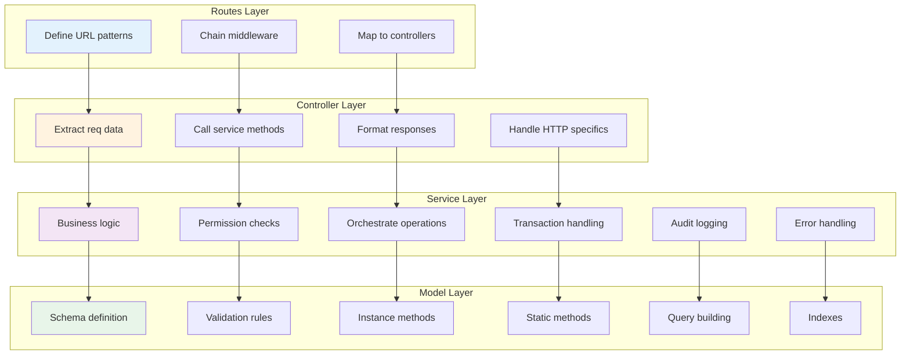

---

## Authentication & Authorization

### Authentication Flow

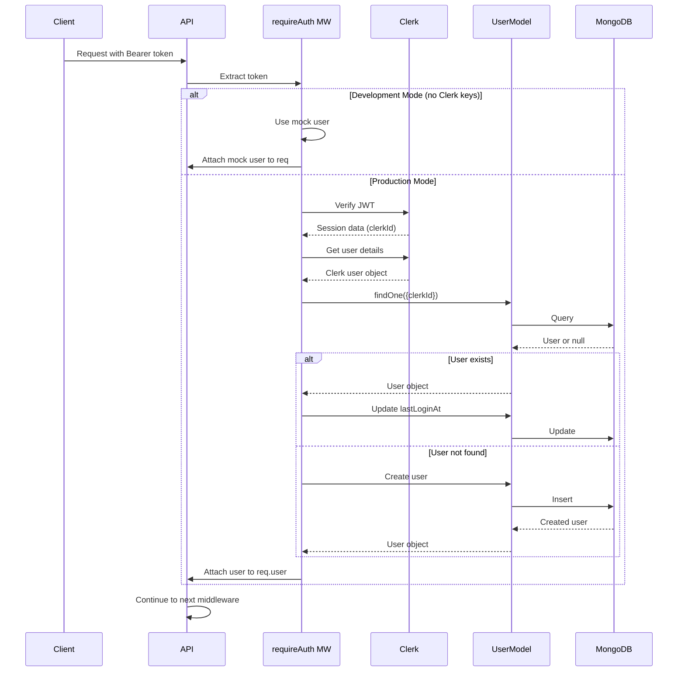

### Authorization Patterns

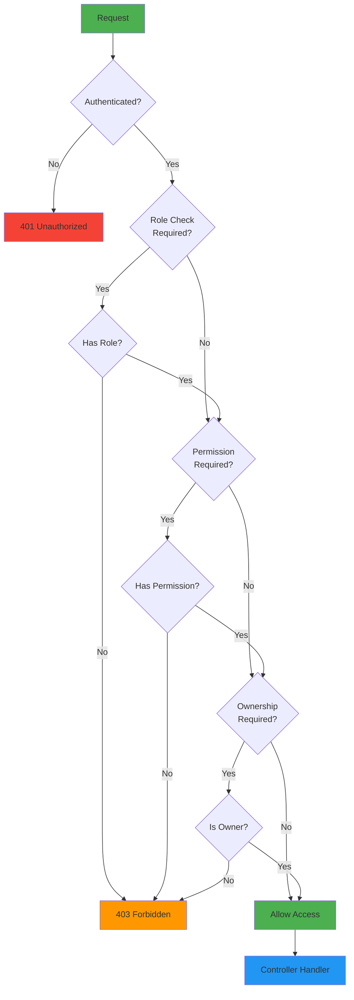

### RBAC System

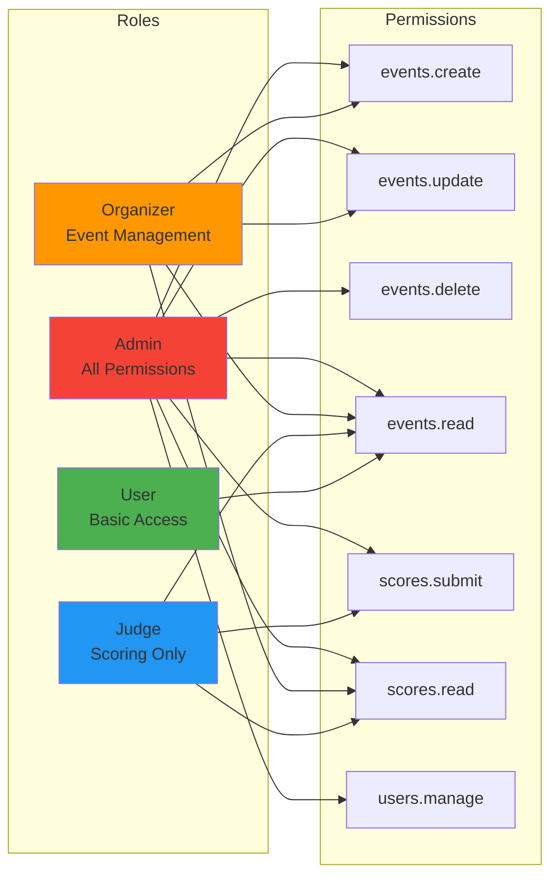

---

## Error Handling System

### Error Class Hierarchy

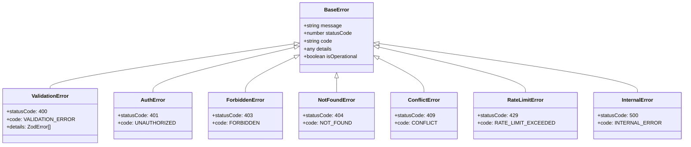

### Error Response Flow

```mermaid
graph TD
    ERROR[Error Thrown] --> ASYNC_HANDLER[asyncHandler catches]
    ASYNC_HANDLER --> NEXT[next(error)]
    NEXT --> ERROR_HANDLER[Global Error Handler]

    ERROR_HANDLER --> LOG{Log Error}
    LOG --> WINSTON[Winston Logger]
    LOG --> SENTRY[Sentry]

    ERROR_HANDLER --> FORMAT[Format Error Response]
    FORMAT --> STATUS[Set HTTP Status Code]
    FORMAT --> MESSAGE[User-friendly message]
    FORMAT --> DETAILS{Include Details?}

    DETAILS -->|Development| STACK[Include stack trace]
    DETAILS -->|Production| NO_STACK[Hide stack trace]

    STACK --> RESPONSE
    NO_STACK --> RESPONSE
    STATUS --> RESPONSE
    MESSAGE --> RESPONSE

    RESPONSE[Send JSON Response]

    style ERROR fill:#f44336
    style ERROR_HANDLER fill:#ff9800
    style RESPONSE fill:#2196f3
```

---

## Module System

### Optional Module Loading

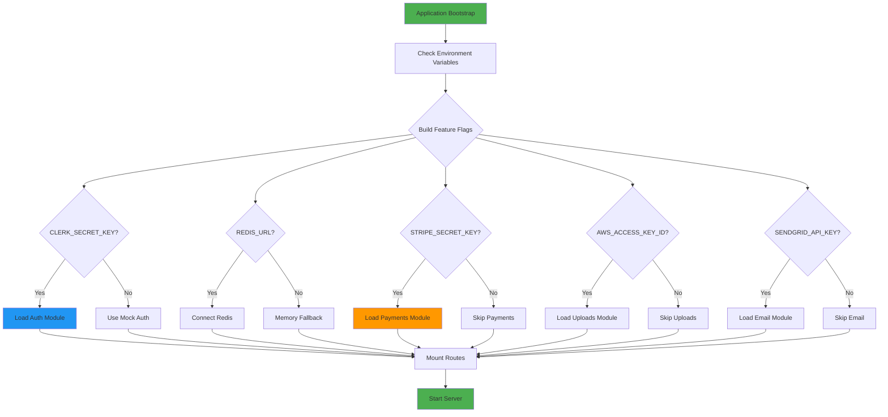

### Module Dependencies

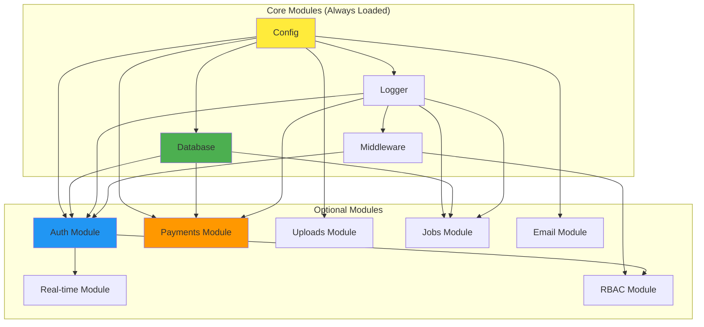

---

## Adding New Features

### Step-by-Step Feature Creation

```mermaid
graph TD
    START[Start New Feature] --> COPY[Copy Example Feature]
    COPY --> RENAME[Rename Files & Classes]

    RENAME --> STEP1[Step 1: Define Model]
    STEP1 --> MODEL_SCHEMA[Create Mongoose Schema]
    MODEL_SCHEMA --> MODEL_METHODS[Add Instance Methods]
    MODEL_METHODS --> MODEL_STATIC[Add Static Methods]
    MODEL_STATIC --> MODEL_INDEX[Define Indexes]

    MODEL_INDEX --> STEP2[Step 2: Define Schemas]
    STEP2 --> ZOD_CREATE[Create Schema]
    ZOD_CREATE --> ZOD_UPDATE[Update Schema]
    ZOD_UPDATE --> ZOD_QUERY[Query Schema]
    ZOD_QUERY --> ZOD_TYPES[Export Types]

    ZOD_TYPES --> STEP3[Step 3: Implement Service]
    STEP3 --> SERVICE_CREATE[create method]
    SERVICE_CREATE --> SERVICE_READ[getById, list methods]
    SERVICE_READ --> SERVICE_UPDATE[update method]
    SERVICE_UPDATE --> SERVICE_DELETE[delete method]
    SERVICE_DELETE --> SERVICE_CUSTOM[Custom business logic]

    SERVICE_CUSTOM --> STEP4[Step 4: Create Controller]
    STEP4 --> CTRL_EXTRACT[Extract request data]
    CTRL_EXTRACT --> CTRL_CALL[Call service methods]
    CTRL_CALL --> CTRL_RESPONSE[Format responses]

    CTRL_RESPONSE --> STEP5[Step 5: Define Routes]
    STEP5 --> ROUTES_PUBLIC[Public routes]
    ROUTES_PUBLIC --> ROUTES_AUTH[Authenticated routes]
    ROUTES_AUTH --> ROUTES_ADMIN[Admin routes]
    ROUTES_ADMIN --> ROUTES_MIDDLEWARE[Chain middleware]

    ROUTES_MIDDLEWARE --> STEP6[Step 6: Register Routes]
    STEP6 --> MOUNT[Mount in index.ts]

    MOUNT --> STEP7[Step 7: Write Tests]
    STEP7 --> TEST_CREATE[Test CRUD operations]
    TEST_CREATE --> TEST_VALIDATE[Test validation]
    TEST_VALIDATE --> TEST_AUTH[Test auth/permissions]
    TEST_AUTH --> TEST_EDGE[Test edge cases]

    TEST_EDGE --> DONE[Feature Complete]

    style START fill:#4caf50
    style STEP1 fill:#e8f5e9
    style STEP2 fill:#fff9c4
    style STEP3 fill:#f3e5f5
    style STEP4 fill:#fff3e0
    style STEP5 fill:#e1f5fe
    style STEP6 fill:#fce4ec
    style STEP7 fill:#ffebee
    style DONE fill:#4caf50
```

### Feature Template Checklist

```mermaid
graph LR
    subgraph "File Checklist"
        F1[✓ model.ts]
        F2[✓ schema.ts]
        F3[✓ service.ts]
        F4[✓ controller.ts]
        F5[✓ routes.ts]
        F6[✓ test.ts]
    end

    subgraph "Code Checklist"
        C1[✓ TypeScript types]
        C2[✓ Zod validation]
        C3[✓ Error handling]
        C4[✓ Audit logging]
        C5[✓ Permission checks]
        C6[✓ Pagination support]
        C7[✓ Soft deletes]
        C8[✓ Indexes defined]
    end

    subgraph "Test Checklist"
        T1[✓ Happy path]
        T2[✓ Validation errors]
        T3[✓ Auth errors]
        T4[✓ Permission errors]
        T5[✓ Edge cases]
        T6[✓ >80% coverage]
    end

    F1 --> C1
    F2 --> C2
    F3 --> C3
    F4 --> C4
    F5 --> C5
    F6 --> T1

    style F1 fill:#4caf50
    style C1 fill:#2196f3
    style T1 fill:#ff9800
```

---

## Best Practices

### Code Organization Principles

```mermaid
mindmap
    root((Best Practices))
        Separation of Concerns
            Models: Data layer
            Services: Business logic
            Controllers: HTTP layer
            Routes: URL mapping
        Type Safety
            Strict TypeScript
            Zod validation
            No 'any' types
            Inferred types
        Error Handling
            Custom error classes
            Global error handler
            Async wrappers
            Detailed logging
        Security
            Input validation
            Rate limiting
            Authentication
            Authorization
            Audit logging
        Performance
            Database indexes
            Query optimization
            Redis caching
            Response compression
        Testing
            Unit tests
            Integration tests
            >80% coverage
            Mock external services
        Documentation
            Code comments
            API documentation
            Architecture diagrams
            README files
```

### Development Workflow

```mermaid
graph TD
    START[Start Development] --> LOCAL[Local Setup]
    LOCAL --> ENV[Configure .env]
    ENV --> DOCKER[docker-compose up]

    DOCKER --> DEVELOP{Development Task}

    DEVELOP -->|New Feature| NEW_FEATURE[Follow Feature Pattern]
    DEVELOP -->|Bug Fix| FIX_BUG[Fix & Add Test]
    DEVELOP -->|Refactor| REFACTOR[Refactor & Test]

    NEW_FEATURE --> WRITE_CODE[Write Code]
    FIX_BUG --> WRITE_CODE
    REFACTOR --> WRITE_CODE

    WRITE_CODE --> LINT[npm run lint]
    LINT --> LINT_OK{Passes?}
    LINT_OK -->|No| FIX_LINT[Fix Lint Errors]
    FIX_LINT --> LINT
    LINT_OK -->|Yes| TEST

    TEST[npm run test] --> TEST_OK{Passes?}
    TEST_OK -->|No| FIX_TEST[Fix Tests]
    FIX_TEST --> TEST
    TEST_OK -->|Yes| BUILD

    BUILD[npm run build] --> BUILD_OK{Builds?}
    BUILD_OK -->|No| FIX_BUILD[Fix Build Errors]
    FIX_BUILD --> BUILD
    BUILD_OK -->|Yes| COMMIT

    COMMIT[git commit] --> PUSH[git push]
    PUSH --> CI[GitHub Actions CI]
    CI --> DEPLOY{Deploy?}

    DEPLOY -->|Yes| PRODUCTION[Deploy to Production]
    DEPLOY -->|No| DONE[Done]

    style START fill:#4caf50
    style LINT_OK fill:#ff9800
    style TEST_OK fill:#ff9800
    style BUILD_OK fill:#ff9800
    style PRODUCTION fill:#2196f3
    style DONE fill:#4caf50
```

### Monitoring & Observability

```mermaid
graph TB
    subgraph "Application Metrics"
        HEALTH[Health Checks<br/>/health endpoint]
        METRICS[Metrics<br/>/metrics endpoint]
        LOGS[Structured Logs<br/>Winston]
    end

    subgraph "Error Tracking"
        SENTRY_APP[Sentry<br/>Error reporting]
        AUDIT[Audit Logs<br/>Database]
    end

    subgraph "Performance Monitoring"
        REQUEST_TIME[Request Duration]
        DB_QUERY[Query Performance]
        CACHE_HIT[Cache Hit Rate]
    end

    subgraph "Alerting"
        ERROR_ALERT[Error Rate Alerts]
        UPTIME_ALERT[Uptime Monitoring]
        PERF_ALERT[Performance Degradation]
    end

    HEALTH --> UPTIME_ALERT
    METRICS --> PERF_ALERT
    LOGS --> SENTRY_APP
    SENTRY_APP --> ERROR_ALERT

    REQUEST_TIME --> METRICS
    DB_QUERY --> METRICS
    CACHE_HIT --> METRICS

    style HEALTH fill:#4caf50
    style SENTRY_APP fill:#f44336
    style METRICS fill:#2196f3
```

---

## Summary

### Architecture Strengths

1. **Type Safety**: Strict TypeScript + Zod validation throughout
2. **Modular**: Optional modules load based on environment
3. **Testable**: Clear separation of concerns, easy to mock
4. **Scalable**: Feature-based structure grows with your app
5. **Observable**: Comprehensive logging and error tracking
6. **Secure**: Authentication, authorization, rate limiting, audit logs
7. **Production-Ready**: Error handling, monitoring, CI/CD

### Quick Reference

| Component | Purpose | Location |
|-----------|---------|----------|
| **Core Config** | Environment, DB, Logger | `src/core/config/` |
| **Middleware** | Request processing | `src/core/middleware/` |
| **Database** | MongoDB models | `src/database/mongodb/` |
| **Auth** | Clerk integration | `src/modules/auth/` |
| **Features** | Business logic | `src/features/*/` |
| **Tests** | Test suites | `tests/` |

### Adding Your First Feature

1. Copy `src/features/example` to `src/features/yourfeature`
2. Rename all files and classes
3. Define your model schema in `model.ts`
4. Create Zod schemas in `schema.ts`
5. Implement business logic in `service.ts`
6. Add HTTP handlers in `controller.ts`
7. Define routes in `routes.ts`
8. Register routes in `src/index.ts`
9. Write tests in `test.ts`
10. Run `npm test` and `npm run build`

### Key Files to Study

- **`src/features/example/example.service.ts`** - Complete CRUD pattern
- **`src/core/server.ts`** - Application setup
- **`src/core/middleware/errorHandler.ts`** - Error handling
- **`src/database/mongodb/models/User.ts`** - Model patterns
- **`src/modules/auth/middleware.ts`** - Authentication flow

---

**Ready to build your SaaS MVP!** 🚀
